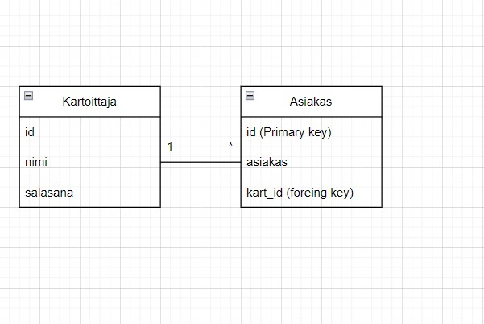

# Laskutustietokanta
Aloimme tietokanta projektin. Minulla on mennyt useampi päivä nettisivujen tekoon replitillä. Ongelmia oli myös tiedon siirossa githubin suuntaan. Loin uuden reposition githubiin.
Jotenkin yhteys toimii nyt. rupean suunnittelemaan tietokantoja ( 27.9)
Tänään tutkittu php toimintaa replitillä. Esimerkiksi https:// codeshack.io 
Laskutustietokannan toteutus
Ensiksi kun haluat kirjautua tietokantaprojektiini luo yhteys php käyttäliittymään
Asenna PHP: https://windows.php.net/download#php-8.1
VS16 x64 Non Thread Safe 

Pura kansioon, jossa säilytät php-tiedostojasi ja nimeä purettu kansio esim. nimellä php.

Avaa command prompt ja mene kansioon, jossa php -tiedostosi sijaitsevat. Kirjoita php\php -S localhost:

Palvelin on nyt käynnistetty. Voita avata osoitteen localhost

php/php.ini-development > muuta nimi > php.ini > avaa tiedosto

extension=mysqli > poista kommentti

extension_dir = "ext" > poista kommentti
Tämän kun olet tehdyt etsi kansion polku ja kopioi polku. Mene command prompt ja C\ cd ja polku (osoite) kansioon. sen jälkeen kirjoita php\php lovalhost: ja portti mistä tieto kulkee.
Sen jälkeen voit avatat visual coden ja

Kun kirjaudut Mysqual workbench   mene kohtaan Data Export. Etsi sieltä ninav_db tietokanta. Tietokannasta löytyy Tablet Kartoittaja, Asiakas, Kartoituskohde ja lasku. 
Hahmoittelin tietokanta tableja paperille ja miten visuaalisesti toteuttaisin tietokantani. Toteutus ei mennyt ihan niin.

Tässä kuva tietokannastani. Tähän asti sain toteutettua työni.
Tässä ovat tietokantani php filet.
Ensimmäiseki tulee index.php sivu, jossa kirjaudutaan sivustolle, kun on rekisteröitynyt aikaisemmin itsensä tällä sivulla tai muuten sivussa on linkki rekistöröintisivulle.
'''
<html> 
    <h1>LASKUTUSOHJELMA</h1>  
      <form action ="kasittely2.php" method ="post"> 
          <label for="nimi"> Nimi </label>
          <input type="text" name="Nimi"> 
          <label for="salasana"> Salasana </label>
          <input type="text" name="Salasana"> 
          <input type="submit" value="Kirjaudu">
        </form>

        
  <a href="kirjaus.php"> lomake</a> 
  <a href= "rekisterointi.php"> Rekisteröidy</a>
  </Body>
</html>
'''

